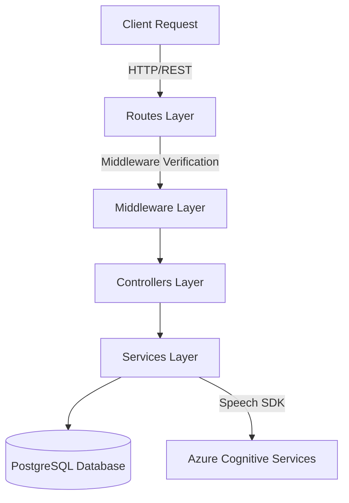

# EngFlex Backend - API Server Documentation

Tài liệu chi tiết mã nguồn, định tuyến, thiết kế cơ sở dữ liệu và triển khai cho phần **Backend** của dự án EngFlex.

---

## 1. Kiến Trúc Backend

Backend được triển khai theo mô hình kiến trúc phân lớp (Layered Architecture/3-Tier Architecture) với các lớp phân tách rõ rệt:



### Chi tiết các lớp:
1. **Routes (`routes/`)**: Định nghĩa các endpoint của API, tích hợp Swagger để sinh tài liệu API tự động, và định tuyến luồng điều khiển qua các middleware xác thực.
2. **Middlewares (`middlewares/`)**:
   - `auth.js`: Giải mã và xác thực Firebase ID Token (`verifyToken`) thông qua Firebase Admin SDK.
   - `role.js`: Kiểm tra quyền hạn của người dùng (`requireRole` - hiện tại chưa được áp dụng trực tiếp).
   - `errorHandler.js`: Middleware tập trung bắt và xử lý lỗi trong toàn bộ hệ thống.
3. **Controllers (`controllers/`)**: Đóng vai trò cầu nối, trích xuất dữ liệu đầu vào từ request (`req.body`, `req.params`, `req.query`), thực hiện phân trang, gọi các service xử lý logic nghiệp vụ và trả về định dạng response chuẩn hóa (`utils/response.js`).
4. **Services (`services/`)**: Nơi thực hiện toàn bộ logic nghiệp vụ của ứng dụng và thực hiện trực tiếp các truy vấn cơ sở dữ liệu (PostgreSQL) thông qua đối tượng kết nối `pool` (Repository Pattern được tích hợp trực tiếp trong Service layer).
5. **Database (`db/` & `migrations/`)**: Quản lý kết nối cơ sở dữ liệu và lưu trữ các file SQL migrations để kiến thiết schema.

---

## 2. API Endpoints Mapping

Dưới đây là bảng định tuyến đầy đủ được quét trực tiếp từ source code thực tế:

### 2.1. Public Routes (Không yêu cầu đăng nhập)

| Method | Endpoint | Controller Handler | Description |
| :--- | :--- | :--- | :--- |
| **GET** | `/api-docs` | `swagger-ui` | Giao diện tài liệu Swagger API Docs |
| **GET** | `/api/v1/categories` | `categoryController.getAllCategories` | Lấy danh sách toàn bộ danh mục bài học |
| **GET** | `/api/v1/lessons` | `lessonsController.getLessons` | Lấy danh sách bài học (hỗ trợ tìm kiếm, phân trang) |
| **GET** | `/api/v1/lessons/:lessonId` | `lessonsController.getLessonById` | Lấy chi tiết một bài học |
| **GET** | `/api/v1/lessons/:lessonId/transcripts` | `transcriptController.getTranscriptsByLessonId` | Lấy danh sách transcript của một bài học |
| **POST** | `/api/v1/auth/login` | `authController.login` | Đăng nhập bằng email/password (qua Firebase API) |
| **GET** | `/api/v1/vocabulary-categories` | `vocabularyController.getVocabulary` | Lấy danh sách danh mục từ vựng |
| **GET** | `/api/v1/vocabulary-decks` | `vocabularyDecksController.getVocabularyDecks` | Lấy danh sách bộ từ vựng (decks) |
| **GET** | `/api/v1/vocabulary-decks/:deckId/items` | `vocabularyItemsController.getVocabularyItems` | Lấy danh sách từ trong một bộ từ vựng |
| **POST** | `/api/v1/vocabulary-decks/:deckId/items` | `vocabularyItemsController.addVocabularyItems` | Thêm từ mới vào bộ từ vựng |
| **PUT** | `/api/v1/vocabulary-decks/:deckId/items/:itemId` | `vocabularyItemsController.updateVocabularyItems` | Cập nhật từ vựng trong bộ |
| **DELETE** | `/api/v1/vocabulary-decks/:deckId/items/:itemId` | `vocabularyItemsController.deleteVocabularyItems` | Xóa từ vựng khỏi bộ |
| **PUT** | `/api/v1/vocabulary-decks/:id` | `vocabularyDecksController.updateVocabularyDecks` | Cập nhật thông tin bộ từ vựng |
| **DELETE** | `/api/v1/vocabulary-decks/:id` | `vocabularyDecksController.deleteVocabularyDecks` | Xóa bộ từ vựng |
| **GET** | `/api/v1/learning-history/test/all` | `learningHistoryController.testGetgetLearningHistory` | Endpoint kiểm tra lịch sử học tập (Test) |

### 2.2. Auth-required Routes (Yêu cầu Authorization header: `Bearer <token>`)

| Method | Endpoint | Controller Handler | Description |
| :--- | :--- | :--- | :--- |
| **POST** | `/api/v1/auth/sync` | `authController.syncUser` | Đồng bộ dữ liệu người dùng từ Firebase về PostgreSQL |
| **GET** | `/api/v1/bookmarks` | `bookmarkController.getBookmarks` | Lấy danh sách các bài học đã đánh dấu (bookmarked) |
| **POST** | `/api/v1/bookmarks/:lessonId` | `bookmarkController.createBookmark` | Đánh dấu một bài học |
| **PATCH** | `/api/v1/bookmarks/:transcriptId` | `bookmarkController.updateBookmarks` | Cập nhật ghi chú bookmark của transcript |
| **DELETE** | `/api/v1/bookmarks/:transcriptId` | `bookmarkController.removeBookmark` | Xóa đánh dấu bài học |
| **GET** | `/api/v1/transcript-bookmarks/:lessonId` | `transcriptBookmarksController.getTranscriptBookmarksByUserId` | Lấy danh sách transcript đã đánh dấu theo bài học |
| **POST** | `/api/v1/transcript-bookmarks` | `transcriptBookmarksController.createTranscriptBookmark` | Đánh dấu/Ghi chú một câu transcript |
| **PUT** | `/api/v1/transcript-bookmarks/:id` | `transcriptBookmarksController.updateTranscriptBookmark` | Cập nhật ghi chú câu transcript |
| **DELETE** | `/api/v1/transcript-bookmarks/:id` | `transcriptBookmarksController.deleteTranscriptBookmark` | Xóa đánh dấu câu transcript |
| **GET** | `/api/v1/transcript-progress/:lessonId` | `transcriptProgressController.getTranscriptProgressById` | Lấy tiến độ đọc transcript của một bài học |
| **POST** | `/api/v1/transcript-progress/:lessonId` | `transcriptProgressController.createTranscriptProgress` | Lưu tiến độ đọc transcript |
| **GET** | `/api/v1/learning-history` | `learningHistoryController.getLearningHistory` | Lấy lịch sử học tập của người dùng |
| **POST** | `/api/v1/learning-history` | `learningHistoryController.recordLearningHistory` | Ghi nhận lịch sử học tập cho một bài học |
| **GET** | `/api/v1/learning-history/finished` | `learningHistoryController.getLearningHistoryFinished` | Lấy lịch sử các bài học đã hoàn thành |
| **GET** | `/api/v1/learning-history/unfinished` | `learningHistoryController.getLearningHistoryUnfinished` | Lấy lịch sử các bài học chưa hoàn thành |
| **GET** | `/api/v1/learning-history/summary` | `learningHistoryController.getLearningHistorySummary` | Lấy báo cáo tóm tắt tiến trình học |
| **GET** | `/api/v1/learning-history/lessons/:lessonId/summary` | `learningHistoryController.getLearningHistorySummaryByLesson` | Tóm tắt lịch sử học tập theo từng bài |
| **GET** | `/api/v1/learning-history/:lessonId` | `learningHistoryController.getLearningHistoryByLesson` | Lấy chi tiết lịch sử học một bài học |
| **GET** | `/api/v1/dictation-status` | `dictationStatusController.getDictationStatus` | Lấy danh sách các câu đã làm bài tập Dictation |
| **POST** | `/api/v1/dictation-status/:transcriptId` | `dictationStatusController.setDictationStatus` | Ghi nhận hoàn thành Dictation một câu |
| **GET** | `/api/v1/shadowing-status` | `shadowingStatusController.getShadowingStatus` | Lấy trạng thái hoàn thành bài Shadowing |
| **POST** | `/api/v1/shadowing-status/:transcriptId` | `shadowingStatusController.setShadowingStatus` | Ghi nhận hoàn thành Shadowing một câu |
| **GET** | `/api/v1/vocabulary-decks/mine` | `vocabularyDecksController.getMyVocabularyDecks` | Lấy danh sách bộ từ vựng cá nhân tự tạo |
| **POST** | `/api/v1/vocabulary-decks` | `vocabularyDecksController.createVocabularyDecks` | Tạo bộ từ vựng cá nhân mới |
| **POST** | `/api/v1/pronunciation-attempts` | `pronunciationAttemptsController.assessPronunciationAttempt` | Tải tệp âm thanh WAV lên và đánh giá phát âm AI |
| **DELETE** | `/api/v1/pronunciation-attempts/attempts/:attemptId` | `pronunciationAttemptsController.deletePronunciationAttempt` | Xóa một lượt thử phát âm |
| **DELETE** | `/api/v1/pronunciation/attempts/:attemptId` | `pronunciationAttemptsController.deletePronunciationAttempt` | Xóa lượt thử phát âm (route phụ) |
| **GET** | `/api/v1/pronunciation/progress/:lessonId` | `pronunciationProgressController.getPronunciationProgress` | Lấy tiến độ phát âm của một bài học |
| **POST** | `/api/v1/pronunciation/progress/update/:transcriptId` | `pronunciationProgressController.updatePronunciationProgress` | Cập nhật điểm phát âm tốt nhất cho câu |

### 2.3. Admin Routes (Bảo mật cho quản trị viên)
> [!WARNING]
> Hiện tại middleware kiểm tra phân quyền quản trị viên (`verifyToken`, `requireRole(ROLES.Admin)`) đang bị comment out trong `routes/adminRoutes.js` (dòng 57). Điều này có nghĩa là các API này đang hoạt động công khai không có lớp kiểm soát phân quyền cụ thể nếu gọi trực tiếp.

| Method | Endpoint | Controller Handler | Description |
| :--- | :--- | :--- | :--- |
| **GET** | `/api/v1/admin/dashboard` | `adminController.getDashboardData` | Lấy thống kê quản trị viên (dữ liệu mock cứng) |
| **GET** | `/api/v1/admin/lessons` | `lessonsController.getLessons` | Lấy danh sách bài học dành cho admin |
| **GET** | `/api/v1/admin/lessons/:id` | `lessonsController.getLessonById` | Lấy chi tiết bài học dành cho admin |
| **POST** | `/api/v1/admin/lessons` | `lessonsController.createLesson` | Tạo bài học mới |
| **PUT** | `/api/v1/admin/lessons/:id` | `lessonsController.updateLesson` | Cập nhật bài học |
| **DELETE** | `/api/v1/admin/lessons/:id` | `lessonsController.deleteLesson` | Xóa bài học |
| **PUT** | `/api/v1/admin/lessons/:lessonId/transcripts` | `transcriptController.replaceTranscripts` | Thay thế toàn bộ transcripts của bài học |
| **POST** | `/api/v1/admin/lessons/:lessonId/transcripts/bulk` | `transcriptController.bulkCreateTranscripts` | Tạo hàng loạt transcripts mới |
| **GET** | `/api/v1/admin/lessons/:lessonId/transcripts` | `transcriptController.getTranscriptsByLessonId` | Lấy transcripts của một bài học |
| **GET** | `/api/v1/admin/categories` | `categoryController.getAllCategories` | Lấy danh sách danh mục (admin) |
| **GET** | `/api/v1/admin/categories/:id` | `categoryController.getCategoryById` | Lấy chi tiết danh mục (admin) |
| **POST** | `/api/v1/admin/categories` | `categoryController.createCategory` | Tạo danh mục mới |
| **PUT** | `/api/v1/admin/categories/:id` | `categoryController.updateCategory` | Cập nhật danh mục |
| **DELETE** | `/api/v1/admin/categories/:id` | `categoryController.deleteCategory` | Xóa danh mục |
| **POST** | `/api/v1/admin/transcripts` | `transcriptController.createTranscript` | Tạo mới một câu transcript lẻ |
| **GET** | `/api/v1/admin/transcripts/:id` | `transcriptController.getTranscriptsById` | Lấy thông tin chi tiết một câu transcript |
| **PUT** | `/api/v1/admin/transcripts/:id` | `transcriptController.updateTranscript` | Cập nhật câu transcript |
| **DELETE** | `/api/v1/admin/transcripts/:id` | `transcriptController.deleteTranscript` | Xóa câu transcript |
| **GET** | `/api/v1/admin/vocabulary-categories/:id` | `vocabularyController.getVocabularyCategorybyCategory` | Lấy danh mục từ vựng (admin) |
| **PUT** | `/api/v1/admin/vocabulary-categories/:id` | `vocabularyController.updateVocabularyCategory` | Cập nhật danh mục từ vựng |
| **DELETE** | `/api/v1/admin/vocabulary-categories/:id` | `vocabularyController.deleteVocabularyCategory` | Xóa danh mục từ vựng |
| **POST** | `/api/v1/admin/vocabulary-categories` | `vocabularyController.createVocabularyCategory` | Tạo danh mục từ vựng mới |

---

## 3. Database Schema

Hệ thống cơ sở dữ liệu PostgreSQL gồm 16 bảng chính:

```mermaid
erDiagram
    users {
        VARCHAR uid PK
        VARCHAR email UNIQUE
        VARCHAR name
        VARCHAR user_role
        VARCHAR avatar_url
        TIMESTAMP created_at
    }
    categories {
        SERIAL id PK
        VARCHAR name UNIQUE
    }
    lessons {
        SERIAL id PK
        INTEGER category_id FK
        VARCHAR title
        TEXT description
        VARCHAR video_url
        VARCHAR thumbnail_url
        VARCHAR level
        DOUBLE duration
        TIMESTAMP created_at
        BOOLEAN is_complete
    }
    transcripts {
        SERIAL id PK
        INTEGER lesson_id FK
        INTEGER sequence
        TEXT content
        VARCHAR phonetic
        TEXT vietnamese
        DOUBLE start_timestamp
        DOUBLE end_timestamp
    }
    bookmarks {
        VARCHAR user_id PK, FK
        INTEGER lesson_id FK
        INTEGER transcript_id PK, FK
        TEXT note
        TIMESTAMP created_at
    }
    transcript_bookmarks {
        SERIAL id PK
        VARCHAR user_id FK
        INTEGER transcript_id FK
        TEXT note
        TIMESTAMP created_at
    }
    transcript_progress {
        VARCHAR user_id PK, FK
        INTEGER transcript_id PK, FK
        INTEGER lesson_id FK
        TIMESTAMP completed_at
    }
    learning_history {
        SERIAL id PK
        VARCHAR user_id FK
        INTEGER lesson_id FK
        BOOLEAN completed_dictation
        BOOLEAN completed_pronunciation
        TIMESTAMP created_at
        TIMESTAMP updated_at
    }
    dictation_status {
        VARCHAR user_id PK, FK
        INTEGER transcript_id PK, FK
        INTEGER lesson_id
        TIMESTAMP completed_at
    }
    shadowing_status {
        VARCHAR user_id PK, FK
        INTEGER transcript_id PK, FK
        INTEGER lesson_id
        TIMESTAMP completed_at
    }
    vocabulary_categories {
        SERIAL id PK
        VARCHAR name UNIQUE
        TEXT description
        TIMESTAMP created_at
        TIMESTAMP updated_at
    }
    vocabulary_decks {
        SERIAL id PK
        VARCHAR user_id FK
        INTEGER category_id FK
        VARCHAR name
        TEXT description
        VARCHAR thumbnail_url
        VARCHAR level
        BOOLEAN is_default
        TIMESTAMP created_at
        TIMESTAMP updated_at
    }
    vocabulary_items {
        SERIAL id PK
        INTEGER deck_id FK
        INTEGER lesson_id FK
        INTEGER transcript_id FK
        VARCHAR phrase
        VARCHAR normalized_phrase
        VARCHAR meaning
        TEXT example_sentence
        TEXT note
        TIMESTAMP created_at
        TIMESTAMP updated_at
    }
    pronunciation_attempts {
        SERIAL id PK
        VARCHAR user_id FK
        INTEGER lesson_id FK
        INTEGER transcript_id FK
        TEXT reference_text
        NUMERIC overall_score
        NUMERIC accuracy_score
        NUMERIC fluency_score
        NUMERIC completeness_score
        NUMERIC prosody_score
        TEXT feedback
        TIMESTAMP created_at
    }
    pronunciation_progress {
        VARCHAR user_id PK, FK
        INTEGER transcript_id PK, FK
        INTEGER lesson_id FK
        INTEGER best_attempt_id FK
        NUMERIC best_score
        TEXT feedback
        TIMESTAMP created_at
        TIMESTAMP updated_at
    }

    users ||--o{ bookmarks : "manages"
    users ||--o{ transcript_bookmarks : "flags"
    users ||--o{ transcript_progress : "tracks"
    users ||--o{ learning_history : "records"
    users ||--o{ dictation_status : "completes"
    users ||--o{ shadowing_status : "completes"
    users ||--o{ vocabulary_decks : "creates"
    users ||--o{ pronunciation_attempts : "performs"
    users ||--o{ pronunciation_progress : "achieves"

    categories ||--o{ lessons : "groups"
    lessons ||--o{ transcripts : "has"
    lessons ||--o{ bookmarks : "targets"
    lessons ||--o{ transcript_progress : "contains"
    lessons ||--o{ learning_history : "summarizes"
    lessons ||--o{ vocabulary_items : "references"
    lessons ||--o{ pronunciation_attempts : "belongs_to"
    lessons ||--o{ pronunciation_progress : "belongs_to"

    transcripts ||--o{ bookmarks : "points"
    transcripts ||--o{ transcript_bookmarks : "points"
    transcripts ||--o{ transcript_progress : "points"
    transcripts ||--o{ dictation_status : "points"
    transcripts ||--o{ shadowing_status : "points"
    transcripts ||--o{ vocabulary_items : "points"
    transcripts ||--o{ pronunciation_attempts : "attempts"
    transcripts ||--o{ pronunciation_progress : "best_ref"

    vocabulary_categories ||--o{ vocabulary_decks : "categorizes"
    vocabulary_decks ||--o{ vocabulary_items : "contains"
    pronunciation_attempts ||--o{ pronunciation_progress : "defines_best"
```

---

## 4. Biến Môi Trường (Environment Variables)

Hệ thống yêu cầu các biến môi trường cấu hình tại file `.env`:

| Biến môi trường | Bắt buộc | Mô tả |
| :--- | :---: | :--- |
| `PORT` | Không | Cổng chạy của Express Server (mặc định: `3000`, trong dev dùng `8000`) |
| `DB_USER` | **Có** | Username đăng nhập PostgreSQL |
| `DB_PASSWORD` | **Có** | Mật khẩu cơ sở dữ liệu PostgreSQL |
| `DB_HOST` | **Có** | Địa chỉ máy chủ database (Ví dụ: `localhost` hoặc tên service docker `db`) |
| `DB_PORT` | **Có** | Cổng kết nối PostgreSQL (Ví dụ: `5432`, hoặc `5430` khi kết nối ngoài Docker) |
| `DB_DATABASE` | **Có** | Tên database khởi tạo (Ví dụ: `EngFlix`) |
| `FIREBASE_WEB_API_KEY` | **Có** | API Key dùng để kết nối với API Firebase Auth REST (để xác thực email/password) |
| `AZURE_SPEECH_KEY` | **Có** | Subscription Key của dịch vụ Azure Cognitive Services Speech |
| `AZURE_SPEECH_REGION` | **Có** | Vùng địa lý đăng ký Azure Speech (Ví dụ: `southeastasia`) |
| `AZURE_VISION_KEY` | Không | Không sử dụng trong mã nguồn hiện tại |
| `AZURE_VISION_ENDPOINT` | Không | Không sử dụng trong mã nguồn hiện tại |
| `DEEPSEEK_API_KEY` | Không | Chỉ dùng cho tệp thử nghiệm độc lập `test.js` |

---

## 5. Hướng Dẫn Triển Khai (Deployment)

### 5.1. Triển khai bằng Docker & Docker Compose (Môi trường phát triển & staging)

Dự án đã tích hợp sẵn Docker Compose bao gồm backend server chạy Node.js và một cơ sở dữ liệu PostgreSQL.

1. **Khởi động các container:**
   ```bash
   docker compose up --build -d
   ```
   *Lệnh này sẽ xây dựng lại image và khởi chạy backend trên cổng `3000` và database PostgreSQL nội bộ trên cổng `5432` (được map ra máy chủ ngoài tại cổng `5430`).*

2. **Khởi tạo dữ liệu cơ sở dữ liệu (Migrations):**
   Sau khi container chạy ổn định, thực thi lệnh sau để tạo cấu trúc bảng:
   ```bash
   docker compose exec backend npm run migrate
   ```

### 5.2. Triển khai thủ công không dùng Docker

1. Cài đặt các gói phụ thuộc:
   ```bash
   npm install
   ```
2. Cấu hình file `.env` khớp với cơ sở dữ liệu PostgreSQL đã được cài đặt trên máy.
3. Thực thi migrations:
   ```bash
   node scripts/run-migrations.js
   ```
4. Khởi chạy server ở chế độ phát triển:
   ```bash
   npm run dev
   ```

---

## 6. Đánh Giá Chất Lượng Mã Nguồn (Code Quality Review)

### 6.1. Điểm mạnh (Strengths)
- **Kiến trúc rõ ràng**: Mô hình 3-tier giúp mã nguồn dễ đọc, các chức năng được phân nhỏ và đóng gói vào controller/service riêng biệt.
- **Tính toán dữ liệu tối ưu**: Tận dụng triệt để cơ chế transaction và các truy vấn phức tạp của PostgreSQL (sử dụng CTE - Common Table Expressions) để thực hiện insert/update tối ưu chỉ trong một lần kết nối cơ sở dữ liệu.
- **Chuẩn hóa Phản Hồi**: Response trả về client được bọc thống nhất dạng `{ data: ..., meta: ..., error: ... }` giúp phía Client dễ dàng viết các lớp phân tích dữ liệu chung.

### 6.2. Điểm yếu & Lỗ hổng tiềm ẩn (Potential Issues)
1. **Lỗ hổng bảo mật Admin**: File `routes/adminRoutes.js` hiện tại **bị comment out** dòng middleware check phân quyền Admin (`verifyToken` và `requireRole`). Điều này cho phép bất kỳ ai cũng có thể gọi trực tiếp các API sửa đổi dữ liệu hệ thống (tạo/sửa/xóa bài học, transcripts, từ vựng) nếu họ tìm ra URL.
2. **Lỗi cú pháp trong script migration**: Trong file `scripts/run-migrations.js` (dòng 37), câu lệnh bắt lỗi `catch` khai báo tham số là `error` nhưng bên trong thân hàm lại gọi `err.message` gây ra lỗi `ReferenceError` nếu quá trình migrate gặp sự cố.
3. **Mounted trùng lặp**: Trong file `index.js`, route `/api/v1/pronunciation` đang được mount hai lần với hai router khác nhau (`pronunciationAttemptsRoutes` và `pronunciationProgressRoutes`). Mặc dù điều này hoạt động do Express gom các sub-path, nó gây nhầm lẫn khi bảo trì.
4. **Biến thừa**: Có nhiều khai báo biến import nhưng không sử dụng, ví dụ: thư viện `cors` ở `categoryController.js`, `{ Pool }` trong các vocabulary services.

### 6.3. Đề xuất cải tiến (Refactoring Suggestions)
- Kích hoạt lại middleware bảo mật quyền Admin bằng cách gỡ bỏ comment ở file `routes/adminRoutes.js`.
- Sửa lỗi bắt ngoại lệ trong `scripts/run-migrations.js` từ `err.message` thành `error.message`.
- Hợp nhất các router liên quan đến cùng một thực thể (ví dụ: gộp các endpoint phát âm về một router duy nhất).