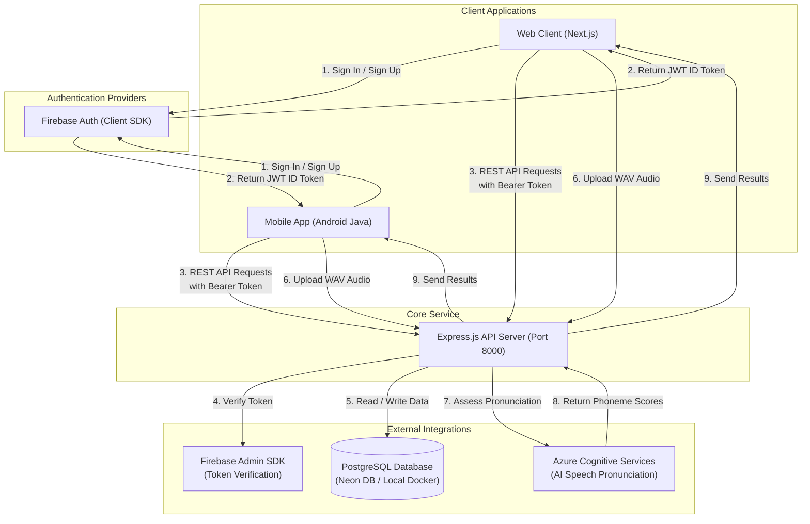

# EngFlex - Hệ Thống Học Tiếng Anh Qua Phim & Video
# [EngFlex - Hệ Thống Học Tiếng Anh Qua Phim & Video](https://eng-flix-alpha.vercel.app/)

Dự án **EngFlex** (trước đây có tên là **EngFlix**) là một hệ thống hỗ trợ học tiếng Anh giao tiếp thông qua phim và video, kết hợp các phương pháp học hiện đại như **Dictation (Chính tả)**, **Shadowing (Nhại giọng)**, và **Đánh giá phát âm (Pronunciation Assessment)** sử dụng trí tuệ nhân tạo.

Hệ thống được thiết kế theo mô hình đa nền tảng gồm 3 thành phần chính:
1. **Backend**: RESTful API server viết bằng Node.js (Express), sử dụng PostgreSQL làm cơ sở dữ liệu chính và tích hợp dịch vụ Firebase Authentication, Azure Cognitive Speech Services.
2. **Frontend (Web App)**: Ứng dụng Web Single Page Application được xây dựng bằng Next.js (App Router), React 19, Tailwind CSS v4, hỗ trợ học tập kéo thả tương tác cao và biểu đồ tiến trình trực quan.
3. **Mobile (Android App)**: Ứng dụng Android Native viết hoàn toàn bằng **Java**, sử dụng kiến trúc Fragment-Repository với kết nối API qua Retrofit, tích hợp module ghi âm và trình phát video cắt lặp đoạn.

---

## 1. Sơ Đồ Kiến Trúc Hệ Thống

Dưới đây là mô hình hoạt động và kết nối giữa các phân hệ trong dự án EngFlex:



---

## 2. Công Nghệ Sử Dụng

### Backend
* **Runtime**: Node.js (CommonJS, ES6)
* **Framework**: Express.js
* **Database**: PostgreSQL (sử dụng thư viện `pg` làm client kết nối)
* **Authentication**: Firebase Admin SDK (xác thực token) & Firebase Auth REST API (giả lập đăng nhập ở API Docs)
* **AI Integrations**: Azure Cognitive Services Speech SDK (đánh giá phát âm chi tiết ở cấp độ âm vị - Phoneme)
* **Containerization**: Docker & Docker Compose
* **API Documentation**: Swagger UI (`swagger-jsdoc`, `swagger-ui-express`)

### Frontend (Web)
* **Framework**: Next.js (App Router), React 19, TypeScript
* **Styling**: Tailwind CSS v4, Framer Motion (`motion`), shadcn UI
* **Drag & Drop**: Hệ thư viện `@dnd-kit` (xử lý sắp xếp các thẻ từ)
* **Charts**: Recharts (vẽ biểu đồ tiến trình học tập)
* **Networking**: Axios Client (tích hợp tự động chèn token và tự động refresh token)
* **Authentication**: Firebase Client SDK

### Mobile (Android)
* **Ngôn ngữ**: Java 11 (Không sử dụng Kotlin)
* **UI & Layout**: XML, Material Components, ViewPager2, FlexboxLayout
* **Networking**: Retrofit 2, OkHttp 4, Gson (tích hợp `AuthInterceptor`)
* **Media**: Trình phát video YouTube (nhúng WebView iframe kết hợp Javascript Bridge)
* **Audio**: API Android `AudioRecord` (thu âm định dạng PCM raw và tự đóng gói header WAV 44 bytes)
* **Navigation**: Jetpack Navigation Component
* **Authentication**: Firebase Auth SDK (Android)

---

## 3. Cấu Trúc Thư Mục Tổng Thể

```text
EngFlex/
├── Backend/               # Mã nguồn API Server (Node.js)
│   ├── config/            # Cấu hình Swagger API Docs
│   ├── constants/         # Các hằng số (Ví dụ: Vai trò người dùng)
│   ├── controllers/       # Lớp điều hướng và xử lý HTTP Request
│   ├── db/                # Kết nối DB và quản lý migrations
│   ├── firebase/          # Cấu hình Firebase Admin SDK
│   ├── middlewares/       # Middleware xác thực và xử lý lỗi tập trung
│   ├── migrations/        # Các file SQL cấu trúc bảng dữ liệu (001 - 012)
│   ├── routes/            # Định nghĩa các endpoint API RESTful
│   ├── services/          # Xử lý logic nghiệp vụ và truy vấn DB trực tiếp
│   ├── utils/             # Các helper dùng chung (response, date, logs)
│   ├── Dockerfile         # Docker build file cho backend
│   └── docker-compose.yml # File cấu hình môi trường Docker chạy cùng DB Postgres
├── frontend/              # Mã nguồn Web Application (Next.js)
│   ├── app/               # Định tuyến các Pages và Layouts (App Router)
│   ├── components/        # React Components chia theo các domain nghiệp vụ
│   ├── hooks/             # Custom React Hooks (`useAuthenticatedUser`, `useMobile`)
│   ├── lib/               # Thư viện bổ trợ (Firebase, API Client, WAV Recorder)
│   ├── public/            # Chứa các tài nguyên hình ảnh tĩnh, favicon
│   └── services/          # Lớp API Service gọi API backend
└── mobile/                # Mã nguồn ứng dụng di động Android
    ├── app/               # Module chính chạy ứng dụng di động (:app)
    │   └── src/main/
    │       ├── AndroidManifest.xml
    │       ├── java/com/example/app/  # Toàn bộ mã nguồn Java của app
    │       └── res/                   # Layouts, drawable, navigation graph (nav_graph.xml)
    ├── core/              # Stub classes cũ (không tham gia build gradle)
    └── feature/           # Stub classes cũ (không tham gia build gradle)
```

---

## 4. Tài Liệu Chi Tiết Các Thành Phần

Mỗi phân hệ trong dự án EngFlex đều có hướng dẫn chi tiết về cách cấu hình biến môi trường, cài đặt dependency, khởi chạy trong môi trường phát triển và triển khai sản phẩm. Vui lòng truy cập các tệp tài liệu riêng dưới đây để biết thêm chi tiết:

* 📖 **Tài liệu và Hướng dẫn cấu hình API Server**: [Backend README](./Backend/README.md)
* 💻 **Tài liệu và Hướng dẫn khởi chạy Web Client**: [Frontend README](./frontend/README.md)
* 📱 **Tài liệu và Hướng dẫn vận hành Android Client**: [Mobile README](./mobile/README.md)
