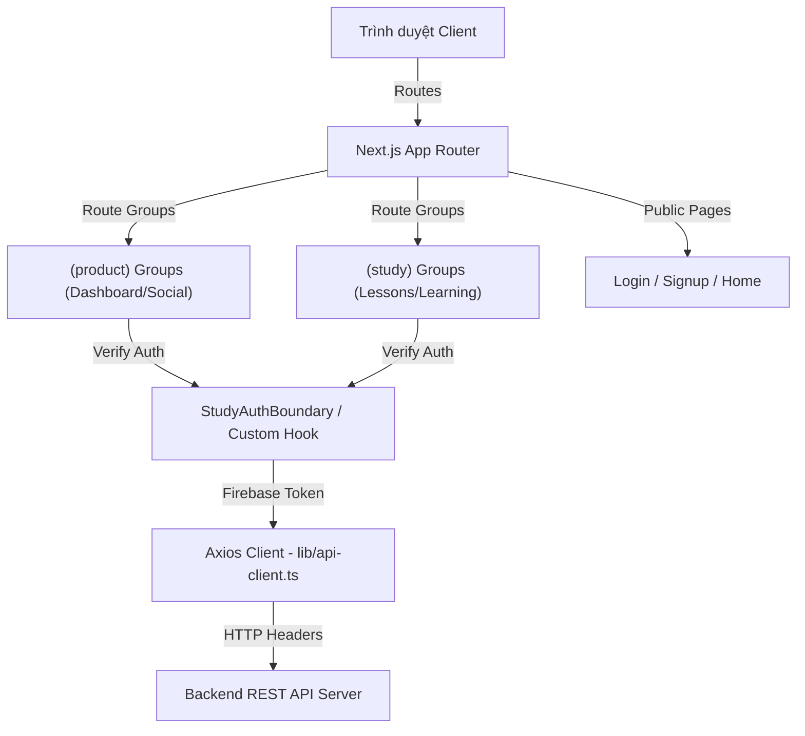

# EngFlex Frontend - Web Application

Module **Frontend** của dự án EngFlex là một ứng dụng Web SPA (Single Page Application) hiện đại được xây dựng trên nền tảng Next.js (App Router), cung cấp giao diện học tập tương tác cao, quản lý từ vựng, theo dõi tiến trình và mạng xã hội học tập trực quan cho người dùng.

---

## 1. Tech Stack

Dưới đây là danh sách các công nghệ và thư viện chính được sử dụng thực tế trong mã nguồn frontend:

* **Ngôn ngữ**: TypeScript (phiên bản `^5`)
* **Framework**: Next.js (phiên bản `16.2.10`, sử dụng cấu trúc **App Router** mới nhất)
* **Thư viện giao diện gốc**: React (phiên bản `19.2.4`)
* **Styling & Theme**: Tailwind CSS v4 (`tailwindcss ^4`, `@tailwindcss/postcss`), `next-themes ^0.4.6`
* **Bộ UI Primitives**: shadcn UI (`components.json`), `@base-ui/react ^1.6.0`, `lucide-react ^1.24.0` (icons)
* **Hiệu ứng chuyển động (Animations)**: Motion (`motion ^12.42.2` - Framer Motion)
* **Kéo thả thẻ từ (Drag & Drop)**: Hệ thư viện `@dnd-kit` (`@dnd-kit/core ^6.3.1`, `@dnd-kit/sortable ^10.0.0`, `@dnd-kit/modifiers`, `@dnd-kit/utilities`)
* **Hiển thị biểu đồ**: Recharts (`^3.8.0` - dùng cho thống kê tiến trình học)
* **API Client**: Axios (`^1.18.1` - kết nối RESTful API đến Backend)
* **Xác thực người dùng (Auth)**: Firebase Client SDK (`^12.16.0`)
* **Xử lý form & Validation**: Zod (`^4.4.3`) kết hợp React state
* **Quản lý bảng dữ liệu**: `@tanstack/react-table ^8.21.3`
* **Thông báo nổi**: Sonner (`^2.0.7`)
* **Code Quality**: ESLint (`eslint-config-next`)
* **Testing framework**: *Chưa được cấu hình trong project.*

---

## 2. Kiến Trúc Frontend

Frontend được phát triển dựa trên mô hình **App Router** của Next.js với cấu trúc phân nhóm chức năng rõ ràng:



### Các nhóm thành phần cốt lõi:
1. **Pages (`app/`)**: Quản lý định tuyến bằng cây thư mục. Sử dụng Route Groups để tách biệt khu vực sản phẩm/mạng xã hội `(product)` và vùng phòng học tập `(study)`.
2. **Components (`components/`)**: Các React component được đóng gói, chia theo domain nghiệp vụ (dictation, shadowing, vocabulary, social, ui) nhằm tăng tính tái sử dụng.
3. **Services (`services/`)**: Các lớp wrapper chứa các hàm gọi API tương ứng với từng module dữ liệu của Backend, giữ cho logic của component tách biệt khỏi kết nối mạng.
4. **Hooks (`hooks/`)**: Chứa custom hooks dùng chung như `useAuthenticatedUser` (quản lý lắng nghe trạng thái đăng nhập Firebase Auth) và `useMobile` (hỗ trợ responsive giao diện).
5. **Lib (`lib/`)**: Các thư viện bổ trợ cấu hình API Client (`api-client.ts`), Firebase Client Config (`firebase.ts`), và mô-đun ghi âm microphone tạo file WAV thô (`wav-recorder.ts`).

---

## 3. Cấu Trúc Thư Mục

Cây thư mục chính của dự án Frontend:

```text
frontend/
├── app/                      # Next.js App Router (Pages và Layouts)
│   ├── (product)/            # Nhóm trang tính năng mạng xã hội, hồ sơ cá nhân
│   │   ├── chat/             # Trang chat cộng đồng trực tuyến
│   │   ├── community/        # Bảng tin cộng đồng (feed, posts)
│   │   ├── friends/          # Quản lý bạn bè, tìm kiếm bạn bè
│   │   ├── notes/            # Quản lý ghi chú cá nhân học tập
│   │   ├── profile/          # Trang cá nhân của người dùng
│   │   ├── progress/         # Thống kê tiến trình học tập của user
│   │   └── vocabulary/       # Xem danh mục từ vựng, bộ từ vựng cá nhân
│   ├── (study)/              # Nhóm trang thực hành học tập
│   │   ├── lessons/[lessonId]/ # Dynamic route học bài học cụ thể
│   │   │   ├── dictation/    # Chế độ thực hành Dictation (nghe chép chính tả)
│   │   │   └── shadowing/    # Chế độ thực hành Shadowing (nhại giọng đánh giá phát âm)
│   │   └── vocabulary/       # Thực hành ôn tập từ vựng bằng Flashcards
│   ├── home/                 # Trang Home giới thiệu dự án
│   ├── login/                # Trang đăng nhập tài khoản
│   ├── signup/               # Trang đăng ký tài khoản
│   ├── globals.css           # Cấu hình Tailwind CSS tokens và styles toàn hệ thống
│   ├── layout.tsx            # Root Layout khởi tạo theme và Firebase context
│   └── page.tsx              # Trang điều hướng gốc
├── components/               # React Components tái sử dụng
│   ├── dictation/            # Giao diện sắp xếp thẻ chữ, audio player
│   ├── landing/              # Thành phần giao diện trang Home/Landing
│   ├── learning/             # Thành phần giao diện luyện tập từ vựng
│   ├── product/              # Layout shell chung cho sản phẩm, sidebar
│   ├── shadowing/            # Giao diện thu âm, hiển thị kết quả phát âm AI
│   ├── ui/                   # Các block UI nguyên bản (shadcn primitives)
│   └── vocabulary/           # Thao tác thêm/sửa/xóa bộ từ vựng, thẻ flashcard
├── hooks/                    # Custom Hooks (`useAuthenticatedUser`, `useMobile`)
├── lib/                      # Các tiện ích (Axios API Client, Firebase SDK, Wav Recorder)
├── public/                   # Chứa hình ảnh tĩnh, icons và favicon
├── services/                 # Lớp API Service gọi API backend
└── types/                    # Khai báo các TypeScript interfaces/types dùng chung
```

---

## 4. Yêu Cầu Hệ Thống

* **Node.js**: Phiên bản `>= 18.17.0` (khuyến nghị `20.x` hoặc mới hơn)
* **npm** hoặc **yarn** hoặc **pnpm**: Trình quản lý package của JavaScript.

---

## 5. Cài Đặt

1. **Di chuyển vào thư mục frontend**:
   ```bash
   cd frontend
   ```

2. **Cài đặt các thư viện**:
   ```bash
   npm install
   ```

3. **Cấu hình file môi trường**:
   Tạo file `.env` tại thư mục gốc của frontend:
   ```bash
   NEXT_PUBLIC_API_URL=http://localhost:8000/api/v1
   NEXT_PUBLIC_FIREBASE_API_KEY=your_firebase_api_key
   NEXT_PUBLIC_FIREBASE_AUTH_DOMAIN=your_project.firebaseapp.com
   NEXT_PUBLIC_FIREBASE_PROJECT_ID=your_project_id
   NEXT_PUBLIC_FIREBASE_STORAGE_BUCKET=your_project.appspot.com
   ```

4. **Khởi động môi trường phát triển**:
   ```bash
   npm run dev
   ```
   *Mở trình duyệt truy cập `http://localhost:3000` để xem kết quả.*

---

## 6. Environment Variables

Bảng mô tả các biến môi trường cấu hình tại file `.env` của Frontend:

| Biến môi trường | Bắt buộc | Mô tả | Ví dụ mẫu |
| :--- | :---: | :--- | :--- |
| `NEXT_PUBLIC_API_URL` | Có | Địa chỉ cổng kết nối API của Backend Server | `http://localhost:8000/api/v1` |
| `NEXT_PUBLIC_FIREBASE_API_KEY` | Có | API Key kết nối Firebase Client SDK | `your_firebase_api_key` |
| `NEXT_PUBLIC_FIREBASE_AUTH_DOMAIN` | Có | Tên miền xác thực Firebase | `your-app.firebaseapp.com` |
| `NEXT_PUBLIC_FIREBASE_PROJECT_ID` | Có | ID của dự án Firebase | `your-app-id` |
| `NEXT_PUBLIC_FIREBASE_STORAGE_BUCKET`| Có | Thùng chứa dữ liệu Firebase Storage | `your-app.appspot.com` |

---

## 7. Cách Chạy Project

Các tập lệnh có sẵn được định nghĩa trong `package.json`:

* **Khởi chạy Development Server**:
  ```bash
  npm run dev
  ```
* **Tạo Production Build**:
  ```bash
  npm run build
  ```
* **Chạy ứng dụng sau khi Build (Production Mode)**:
  ```bash
  npm run start
  ```
* **Kiểm tra cú pháp code (Linting)**:
  ```bash
  npm run lint
  ```

---

## 8. Chức Năng Chính

Ứng dụng Frontend cung cấp đầy đủ các giao diện tính năng sau:
1. **Đăng nhập & Đăng ký**: Giao diện đăng nhập, đăng ký bằng email/mật khẩu được thiết kế đẹp mắt kết hợp với đăng nhập nhanh qua Google Sign-In thông qua Firebase Client SDK.
2. **Dashboard & Sidebar**: Thanh Sidebar điều hướng thông minh (`app-sidebar.tsx`) cho phép chuyển đổi nhanh chóng giữa các khu vực của ứng dụng kèm cơ chế ẩn hiện linh hoạt trên di động.
3. **Danh sách bài học**: Hiển thị bài học theo cấp độ (Beginner, Intermediate, Advanced) có kèm phân trang và tìm kiếm theo tiêu đề.
4. **Phòng thực hành Dictation**:
   - Trình phát video YouTube được đồng bộ hóa mốc thời gian.
   - Các chữ cái/từ trong câu được chuyển hóa thành các thẻ từ có thể kéo thả để ghép thành câu hoàn chỉnh nhờ thư viện `@dnd-kit`.
5. **Phòng thực hành Shadowing**:
   - Tích hợp module thu âm microphone trực tiếp (`wav-recorder.ts`).
   - Tự động mã hóa tín hiệu âm thanh thu được sang file định dạng WAV chuẩn (16kHz, Mono, 16-bit PCM) và gửi lên máy chủ.
   - Hiển thị điểm số phát âm chi tiết từ AI và tô màu phản hồi lỗi sai cho từng từ.
6. **Hệ thống ôn từ vựng**:
   - Xem từ vựng chi tiết, tạo bộ từ vựng cá nhân.
   - Giao diện Flashcard ôn tập từ vựng sống động với hiệu ứng xoay lật 3D mượt mà bằng Framer Motion.
7. **Bảng thống kê tiến độ**: Hiển thị biểu đồ hoạt động học tập (Recharts), danh sách các bài học đã hoàn thành và bài học chưa hoàn thành.
8. **Mạng xã hội học tập**:
   - Đọc bảng tin cộng đồng (feed).
   - Đăng bài viết chia sẻ, nút Thích (like), bình luận dưới bài viết.
   - Ghé thăm tường cá nhân của người học khác.
9. **Kênh Chat cộng đồng**: Gửi tin nhắn tức thời và nhận tin nhắn thời gian thực trong phòng chat chung.
10. **Quản lý Bạn bè**: Tìm kiếm người dùng khác, gửi lời mời kết bạn và quản lý danh sách bạn bè hiện có.

---

## 9. API Documentation

> [!NOTE]
> Giao diện Frontend là ứng dụng client tiêu thụ API, **không tự cung cấp hay định nghĩa các API Endpoints**.
> 
> Tuy nhiên, Frontend gọi trực tiếp tới các endpoint REST của Backend thông qua Axios client. Xem tài liệu API đầy đủ của Backend tại: [Backend README.md](file:///d:/EngFlex/Backend/README.md) hoặc truy cập URL Swagger `/api-docs` khi Backend đang chạy.

---

## 10. Kết Nối Giữa Các Module

* **Base URL**: Được cấu hình thông qua biến `NEXT_PUBLIC_API_URL` trong file `.env`. Trong môi trường phát triển local, Client gọi đến Backend tại địa chỉ `http://localhost:8000/api/v1`.
* **Xác thực tự động (Auth Interceptor)**:
  - Khi thực hiện các request thông qua `apiRequest` trong `lib/api-client.ts`, hệ thống sẽ gọi phương thức của Firebase SDK `firebaseUser.getIdToken()` để lấy token JWT mới nhất của người dùng.
  - Token được chèn tự động vào header: `Authorization: Bearer <TOKEN>`.
  - Nếu backend trả về mã lỗi `401 Unauthorized` do token hết hạn, client sẽ thực thi force refresh token qua Firebase Auth và gửi lại request tự động.
* **Đồng bộ cơ sở dữ liệu**: Khi đăng ký tài khoản thành công lần đầu tiên trên Web, client sẽ kích hoạt một request `POST /api/v1/auth/sync` lên backend để khởi tạo bản ghi thông tin người dùng trong cơ sở dữ liệu PostgreSQL.

---

## 11. Database

> [!NOTE]
> Module Frontend **không kết nối và thao tác trực tiếp với cơ sở dữ liệu**.
> 
> Mọi tương tác dữ liệu đều thông qua các request REST gửi tới API Server của Backend. Việc lưu trữ file ghi âm hoặc ảnh đại diện được xử lý qua Firebase Storage hoặc upload tạm lên thư mục của Backend.

---

## 12. Testing

> [!NOTE]
> Module Frontend **hiện chưa cấu hình bộ kiểm thử tự động (như Jest, Cypress, Playwright)**. 
> 
> Việc kiểm thử các chức năng và giao diện hiện tại được thực hiện thủ công (Manual Testing) trên các trình duyệt tiêu chuẩn trong môi trường phát triển.

---

## 13. Code Quality

* **Công cụ**: Sử dụng **ESLint** để phân tích mã nguồn tĩnh và phát hiện các lỗi cú pháp.
* **Cấu hình linter**: Khai báo tại file [eslint.config.mjs](file:///d:/EngFlex/frontend/eslint.config.mjs).
* **Lệnh kiểm tra lỗi**:
  ```bash
  npm run lint
  ```
* **Type checking**: Được kiểm soát chặt chẽ bởi TypeScript compiler (`tsconfig.json`).

---

## 14. Build và Deployment

### Triển khai trên Vercel (Khuyến nghị)
Next.js được tối ưu hóa tốt nhất khi triển khai trực tiếp lên dịch vụ Cloud của **Vercel**:
1. Đẩy mã nguồn frontend lên một kho chứa Git (GitHub, GitLab, Bitbucket).
2. Tạo dự án mới trên Vercel và liên kết tới kho chứa đó.
3. Trong phần **Environment Variables**, thêm đầy đủ các biến môi trường cấu hình tại mục [Environment Variables](#6-environment-variables).
4. Vercel sẽ tự động phát hiện Next.js, thực thi `npm run build` và deploy ứng dụng.

### Tự triển khai bằng Production Build
Nếu muốn build ứng dụng thủ công và chạy trên máy chủ riêng:
1. Tạo build tối ưu:
   ```bash
   npm run build
   ```
   *Mã nguồn đã được biên dịch tối ưu sẽ nằm trong thư mục ẩn `.next`.*
2. Khởi chạy máy chủ sản xuất Next.js Node:
   ```bash
   npm run start
   ```

---

## 15. Troubleshooting

1. **Lỗi `Firebase: Error (auth/invalid-api-key)`**:
   - *Nguyên nhân*: Các biến cấu hình Firebase client trong `.env` bị thiếu hoặc sai.
   - *Khắc phục*: Kiểm tra kỹ xem biến môi trường có tiền tố `NEXT_PUBLIC_` hay chưa (ví dụ: `NEXT_PUBLIC_FIREBASE_API_KEY`). Nếu thiếu tiền tố này, Next.js sẽ không thể export biến ra ngoài môi trường Client/Trình duyệt.
2. **Lỗi Blocked by CORS Policy khi gọi API**:
   - *Nguyên nhân*: Địa chỉ Backend API hoặc cấu hình cors bên phía backend chưa chấp nhận port chạy của Frontend (ví dụ: `http://localhost:3000`).
   - *Khắc phục*: Kiểm tra lại file `.env` xem `NEXT_PUBLIC_API_URL` đã trỏ đúng cổng của Backend (mặc định là `8000`) chưa, và kiểm tra cấu hình CORS của Backend.
3. **Không thu âm được trong chế độ Shadowing**:
   - *Nguyên nhân*: Trình duyệt chưa được cấp quyền truy cập Microphone, hoặc đang truy cập trang web qua HTTP thông thường (không phải HTTPS/localhost) khiến trình duyệt chặn các API bảo mật của Web Audio.
   - *Khắc phục*: Cấp quyền ghi âm cho trang web trong cài đặt trình duyệt. Khi deploy production, bắt buộc phải cài đặt chứng chỉ bảo mật SSL (HTTPS) thì tính năng thu âm mới hoạt động.

---

## 16. Security Notes

* **Biến môi trường Client**: Chỉ đặt tiền tố `NEXT_PUBLIC_` cho các biến thực sự an toàn khi công khai trên trình duyệt (như Firebase config của client hoặc URL API). Tuyệt đối không khai báo key bí mật (private keys) ở file `.env` của frontend.
* **Microphone Access**: Ứng dụng chỉ yêu cầu quyền ghi âm khi người dùng nhấn nút thu âm trong chế độ Shadowing và sẽ tự động giải phóng microphone ngay khi quá trình ghi âm kết thúc để bảo vệ quyền riêng tư.
* **HTTPS**: Bắt buộc triển khai giao thức HTTPS trên môi trường production để bảo vệ mã token xác thực truyền nhận trên đường truyền và kích hoạt các API ghi âm HTML5.

---

## 17. Contributing

Quy trình đóng góp phát triển frontend:
1. Tạo nhánh phát triển (`git checkout -b feature/ui-improvement`).
2. Sửa đổi code và tạo các component trong thư mục tương ứng. Tuân thủ quy định phối màu và cỡ chữ tại tài liệu [UI_DESIGN_SYSTEM.md](file:///d:/EngFlex/frontend/UI_DESIGN_SYSTEM.md).
3. Chạy `npm run lint` để đảm bảo code không dính lỗi cú pháp và cảnh báo.
4. Mở Pull Request giải thích rõ các màn hình đã thay đổi.

---

## 18. License

> Project hiện chưa khai báo license.
