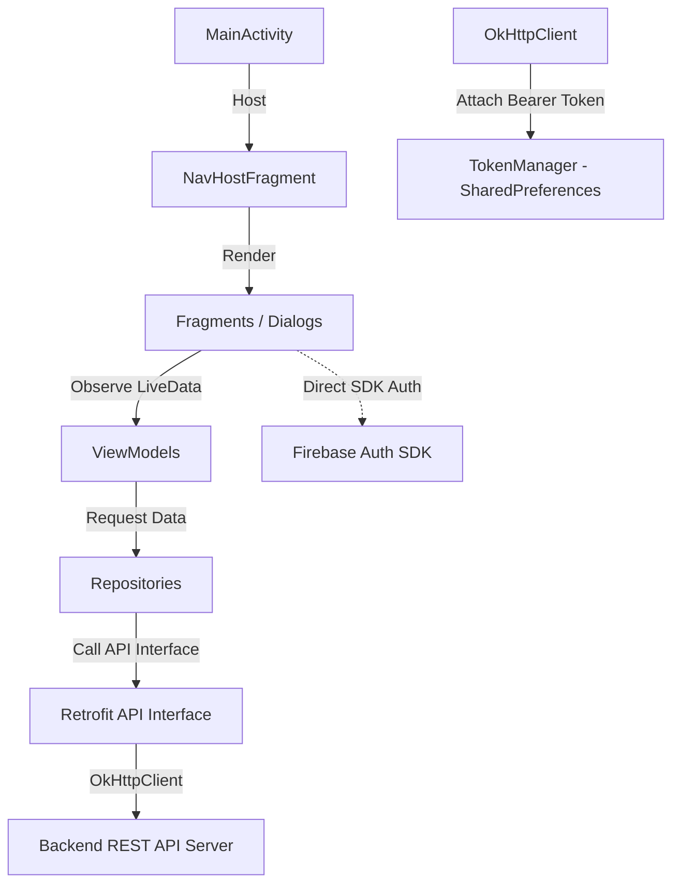

# EngFlex Mobile - Android Application

Module **Mobile** của dự án EngFlex là một ứng dụng di động Android Native được xây dựng hoàn toàn bằng ngôn ngữ **Java**, đóng vai trò là ứng dụng client cho phép người dùng học tiếng Anh tương tác (Dictation, Listening), quản lý từ vựng cá nhân, theo dõi tiến độ, mạng xã hội và chat cộng đồng mọi lúc mọi nơi trên thiết bị di động.

---

## 1. Tech Stack

Dưới đây là danh sách các công nghệ và thư viện chính được sử dụng thực tế trong mã nguồn di động:

* **Ngôn ngữ**: Java (Java Compatibility 11)
* **SDK Version**: compileSdk `36`, targetSdk `36`, minSdk `24`
* **Hệ thống Build**: Gradle Kotlin DSL (`build.gradle.kts`, `settings.gradle.kts`)
* **Kiến trúc UI**: Fragment - ViewBinding - Recycler View Adapters
* **Quản lý Điều hướng**: Jetpack Navigation Component (`androidx.navigation`)
* **State & Data Lifecycle**: ViewModel (`androidx.lifecycle`), LiveData (`androidx.lifecycle`)
* **API Client**: Retrofit (phiên bản `2.9.0`), Gson Converter (`2.9.0`), OkHttp (`4.12.0`)
* **Logging mạng**: OkHttp Logging Interceptor (`4.12.0`)
* **Xác thực**: Firebase Authentication SDK (thông qua BOM `34.12.0`)
* **Lưu trữ dữ liệu đám mây di động**: Firebase Firestore SDK
* **Tải và hiển thị hình ảnh**: Glide (`4.16.0`)
* **Thiết kế bố cục linh hoạt**: Google FlexboxLayout (`3.0.0` - dùng xếp thẻ từ)
* **Thành phần UI nâng cao**: ViewPager2 (`1.0.0`), CardView (`1.0.0`), CircleImageView (`3.1.0`)
* **Thu âm và xử lý Audio**: API hệ thống Android `AudioRecord` (ghi đè WAV header 44 bytes)
* **Trình phát video**: YouTube iframe Player nhúng WebView (`YouTubeWebViewManager`)
* **Testing framework**: JUnit, AndroidJUnitRunner, Espresso (Boilerplate)

---

## 2. Kiến Trúc Ứng Dụng

Ứng dụng di động tuân thủ mô hình kiến trúc phân tách trách nhiệm giữa giao diện và dữ liệu (Fragment-Repository-API):



### Các lớp kiến trúc chính:
1. **UI Layer (Fragments, Adapters, Dialogs)**: Chỉ tập trung hiển thị giao diện, tiếp nhận tương tác người dùng, hiển thị các adapter danh sách (RecyclerView) và quan sát (observe) các thay đổi dữ liệu từ ViewModel.
2. **ViewModel Layer**: Giữ trạng thái dữ liệu của màn hình độc lập với vòng đời của Fragment, gọi Repository lấy dữ liệu và cập nhật dữ liệu ra các đối tượng LiveData.
3. **Repository Layer**: Lớp trừu tượng hóa nguồn dữ liệu, kết nối và nhận dữ liệu từ các Retrofit API Service.
4. **Data Layer (local/remote)**:
   - `local/TokenManager.java`: Quản lý lưu trữ và truy xuất Firebase ID Token bảo mật trong SharedPreferences của thiết bị.
   - `remote/RetrofitClient.java`: Khởi tạo và quản lý một instance Retrofit duy nhất (Singleton pattern) đi kèm OkHttpClient đã đăng ký `AuthInterceptor` và log.
5. **Utils/Helpers**: Chứa hằng số hệ thống (`Constants.java`) và trình điều khiển phát video YouTube tùy biến qua WebView Javascript bridge (`YouTubeWebViewManager.java`).

---

## 3. Cấu Trúc Thư Mục

Cây thư mục quan trọng thuộc module ứng dụng `:app` của dự án Mobile:

```text
mobile/
├── app/
│   ├── src/
│   │   ├── main/
│   │   │   ├── java/com/example/app/
│   │   │   │   ├── adapter/            # Các adapter cho RecyclerView (bài học, từ vựng, thẻ từ, bình luận)
│   │   │   │   ├── core/               # Chứa các lớp base dùng chung cho UI
│   │   │   │   ├── data/               # Tầng dữ liệu nghiệp vụ
│   │   │   │   │   ├── local/          # TokenManager lưu token xác thực
│   │   │   │   │   ├── remote/         # Cấu hình Retrofit, Models, Interceptors, và APIs
│   │   │   │   │   │   ├── api/        # Định nghĩa các interface API Retrofit
│   │   │   │   │   │   ├── interceptor/ # AuthInterceptor đính kèm JWT Token
│   │   │   │   │   │   └── model/      # Các POJO classes đại diện cho JSON response
│   │   │   │   │   └── repository/     # Lớp Repository trung gian giao tiếp dữ liệu
│   │   │   │   ├── diaglog/            # Hộp thoại hiển thị BottomSheet chọn chế độ học, ghi chú
│   │   │   │   ├── feature/            # Các luồng màn hình và tính năng chính của app
│   │   │   │   │   ├── auth/           # LoginFragment, SignupFragment
│   │   │   │   │   ├── note/           # Quản lý ghi chú cá nhân học tập
│   │   │   │   │   ├── progress/       # Xem tiến trình bài học hoàn thành, học dở
│   │   │   │   │   ├── setting/        # Xem thông tin tài khoản, chỉnh sửa hồ sơ
│   │   │   │   │   ├── study/          # Xem danh sách bài học, chép chính tả (Dictation), học nghe (Listening)
│   │   │   │   │   └── vocabulary/     # Xem bộ từ, flashcard, kiểm tra từ vựng, tự tạo deck
│   │   │   │   ├── utils/              # Các tiện ích bổ trợ (Constants, Webview YouTube Manager)
│   │   │   │   └── MainActivity.java   # Activity chính quản lý thanh điều hướng bottom nav và host fragments
│   │   │   ├── res/                    # Thư mục chứa tài nguyên giao diện XML, hình ảnh, màu sắc
│   │   │   │   ├── layout/             # Thiết kế giao diện XML cho các Fragments, Items
│   │   │   │   ├── navigation/         # Bản đồ điều hướng nav_graph.xml
│   │   │   │   └── values/             # Định nghĩa colors, strings, styles, themes
│   │   │   └── AndroidManifest.xml     # Khai báo cấu hình ứng dụng, quyền internet, ghi âm
│   │   └── test/                       # Chứa tệp unit test cơ bản (ExampleUnitTest.java)
│   ├── build.gradle.kts                # Cấu hình Gradle của module app
│   └── google-services.json            # Tệp cấu hình dịch vụ Firebase Client (đăng ký từ Firebase Console)
├── build.gradle.kts                    # Cấu hình Gradle chung của dự án
├── settings.gradle.kts                 # Cấu hình thiết lập dự án đa module (chỉ include :app)
└── local.properties                    # Lưu trữ cục bộ đường dẫn SDK và các biến môi trường cấu hình build
```

> [!NOTE]
> Các thư mục như `mobile/feature/` và `mobile/core/` nằm ngoài thư mục `mobile/app/` là các thư mục rỗng cũ hoặc placeholder, hiện tại **không tham gia vào quá trình build** và không thuộc phạm vi hoạt động của Gradle project di động.

---

## 4. Yêu Cầu Hệ Thống

Để phát triển và chạy ứng dụng di động này, bạn cần chuẩn bị:

* **Java Development Kit (JDK)**: Phiên bản `17` hoặc `21` (được khuyên dùng cho cấu hình Gradle mới).
* **Android Studio**: Phiên bản Jellyfish / Koala hoặc mới hơn.
* **Android SDK**: Cài đặt SDK Platform 36 thông qua Android SDK Manager.
* **Thiết bị chạy**:
  - Android Emulator (Máy ảo chạy Android API >= 24).
  - Hoặc thiết bị Android thật đã bật tùy chọn nhà phát triển và USB Debugging.

---

## 5. Cài Đặt

1. **Sao chép mã nguồn và mở bằng Android Studio**:
   Khởi chạy Android Studio, chọn **File** -> **Open** và trỏ đến thư mục `mobile/` của dự án.

2. **Cấu hình file môi trường**:
   Mở hoặc tạo mới file [local.properties](file:///d:/EngFlex/mobile/local.properties) ở thư mục gốc `mobile/` và cấu hình các giá trị môi trường của bạn:
   ```properties
   sdk.dir=C\:\\Users\\Tên_User\\AppData\\Local\\Android\\Sdk
   FIREBASE_API_KEY=your_firebase_api_key
   BASE_URL=http://10.0.2.2:8000/api/v1/
   ```
   *Lưu ý: Thay đổi `sdk.dir` đúng với đường dẫn SDK trên máy của bạn.*

3. **Cài đặt Firebase Client Configuration**:
   Đảm bảo bạn tải file cấu hình `google-services.json` từ dự án Firebase di động của bạn và đặt vào thư mục [mobile/app/](file:///d:/EngFlex/mobile/app/).

4. **Đồng bộ hóa Gradle**:
   Bấm vào nút **Sync Project with Gradle Files** trên thanh công cụ của Android Studio để IDE tự động tải về các thư viện phụ thuộc.

5. **Chạy ứng dụng**:
   Chọn thiết bị mục tiêu (máy ảo hoặc máy thật) và nhấn biểu tượng **Run (nút tam giác xanh)** hoặc phím tắt `Shift + F10` để biên dịch cài đặt ứng dụng.

---

## 6. Environment Variables

Các biến môi trường phục vụ việc biên dịch (đọc thông qua tệp `local.properties` và ghi vào `BuildConfig` trong `build.gradle.kts`):

| Biến | Bắt buộc | Mô tả | Ví dụ |
| :--- | :---: | :--- | :--- |
| `sdk.dir` | Có | Đường dẫn tuyệt đối đến thư mục chứa bộ cài Android SDK của bạn | `C\:\\Android\\Sdk` |
| `FIREBASE_API_KEY` | Có | API Key dùng để kết nối với các dịch vụ Firebase trên thiết bị di động | `your_firebase_api_key` |
| `BASE_URL` | Có | URL của Backend Server API phục vụ cho Retrofit client | `http://10.0.2.2:8000/api/v1/` |

> [!TIP]
> * Trong môi trường chạy máy ảo (Emulator), sử dụng địa chỉ `http://10.0.2.2:8000/api/v1/` để kết nối vào localhost của máy tính host.
> * Trong môi trường chạy thiết bị thật, hãy cắm chung mạng Wifi với máy tính và cấu hình `BASE_URL=http://<IP_MÁY_TÍNH>:8000/api/v1/`.

---

## 7. Cách Chạy Project

* **Khởi chạy từ Android Studio**: Sử dụng giao diện đồ họa Studio để Run / Debug trực tiếp.
* **Biên dịch Debug APK qua Gradle CLI**:
  Di chuyển vào thư mục `mobile` và chạy lệnh sau (sử dụng `./gradlew` cho Linux/macOS hoặc `gradlew.bat` cho Windows):
  ```bash
  ./gradlew assembleDebug
  ```
  *File APK đầu ra sẽ nằm ở: `app/build/outputs/apk/debug/app-debug.apk`*
* **Dọn dẹp thư mục Build**:
  ```bash
  ./gradlew clean
  ```

---

## 8. Chức Năng Chính

Ứng dụng di động hiện tại đã được hiện thực hóa đầy đủ các tính năng:
1. **Đăng nhập & Đăng ký**: Tích hợp trực tiếp với Firebase Authentication SDK để quản lý tài khoản người dùng, đồng bộ hồ sơ về database backend qua endpoint `/auth/sync`.
2. **Học qua Video (Listening Fragment)**:
   - Nhúng trình phát video YouTube thông qua WebView tải iframe không cookie (`youtube-nocookie.com`).
   - Xây dựng giao diện điều khiển tùy biến (`YouTubeWebViewManager`) cho phép chuyển đổi phụ đề, tua nhanh/chậm video, tạm dừng/phát.
   - Hỗ trợ cắt nhỏ video và tự động phát lặp lại một phân đoạn câu (dựa trên start/end timestamp của câu transcript) để người dùng tập trung nghe chép.
3. **Thực hành chính tả (Dictation Fragment)**:
   - Người dùng nghe audio của từng câu, sau đó sắp xếp các thẻ chữ cái/từ nằm trong bố cục FlexboxLayout (thông qua `WordCardAdapter`) để ghép thành câu đúng.
   - Lưu trạng thái hoàn thành bài tập của từng câu qua API.
4. **Ôn tập Từ vựng (Vocabulary Fragment)**:
   - Hiển thị danh sách từ vựng hệ thống và các bộ từ vựng cá nhân tự tạo (`VocabularyDecksPageFragment`).
   - Hỗ trợ ôn tập qua thẻ ghi nhớ Flashcard (`FlashcardFragment`) tương tác trực quan lật thẻ.
   - Cho phép Thêm/Sửa/Xóa từ vựng cá nhân trực tiếp trên ứng dụng (`AddVocabularyItemFragment`, `EditItemsFragment`).
5. **Theo dõi tiến độ học tập (Progress Fragment)**:
   - Xem tổng hợp các bài học đã hoàn thành (`ProgressFragmentCompleted`) và bài học chưa hoàn thành (`ProgressFragmentUncompleted`) trên giao diện Tab sử dụng ViewPager2.
6. **Quản lý ghi chú (Note Feature)**:
   - Thêm nhanh ghi chú cho bài học hoặc câu cụ thể (`AddNoteFragment`).
   - Giao diện quản lý toàn bộ ghi chú cá nhân học tập (`MyNoteFragment`).

---

## 9. API Integration

Mọi cuộc gọi API đều được thông qua instance của **Retrofit** được cấu hình trong [RetrofitClient.java](file:///d:/EngFlex/mobile/app/src/main/java/com/example/app/data/remote/RetrofitClient.java).

### Các API interfaces tương ứng bao gồm:
* `AuthApi.java`: Gửi yêu cầu đăng nhập và đồng bộ tài khoản người dùng lên server PostgreSQL.
* `LessonsApi.java` & `TranscriptsApi.java`: Tải danh sách bài học, thông tin chi tiết bài học và các câu transcripts.
* `CategoryApi.java`: Lấy danh sách danh mục phân loại bài học.
* `BookMarksApi.java` & `TranscriptBookmarksApi.java`: Thao tác lưu trữ, chỉnh sửa và lấy thông tin ghi chú/bookmarks.
* `ProgressApi.java` & `TranscriptProgressApi.java`: Lưu nhận trạng thái học tập của người dùng.
* `VocabularyApi.java`: Thực hiện CRUD các bộ từ vựng cá nhân và items từ vựng.
* `PronunciationApi.java`: Gửi tệp âm thanh WAV lên máy chủ đánh giá phát âm và lấy điểm số tốt nhất.

---

## 10. Kết Nối Giữa Các Module

* **Authentication (Cơ chế đính kèm Token)**:
  - Khi người dùng đăng nhập thành công qua Firebase Auth, JWT Token (ID Token) sẽ được lưu vào SharedPreferences thông qua `TokenManager`.
  - Mọi request API gửi đi từ ứng dụng di động sẽ tự động đi qua **`AuthInterceptor`** (được đăng ký trong cấu hình OkHttpClient của `RetrofitClient`).
  - `AuthInterceptor` sẽ lấy token từ `TokenManager` và chèn header xác thực: `Authorization: Bearer <ID_TOKEN>`.
* **Thu âm và gửi dữ liệu thô (Multipart Request)**:
  - Ứng dụng di động thu âm dữ liệu thô (PCM) từ microphone bằng `AudioRecord` với các thông số: Tần số lấy mẫu `16000Hz`, kênh `Mono`, mã hóa `16-bit PCM`.
  - Khi kết thúc, ứng dụng tự động chèn thêm cấu trúc WAV Header 44 bytes để đóng gói thành tệp âm thanh định dạng `.wav`.
  - Tệp âm thanh `.wav` này sau đó được tải lên Backend thông qua một cuộc gọi HTTP POST sử dụng định dạng `MultipartBody.Part` đến API đánh giá phát âm của backend.

---

## 11. Database

> [!NOTE]
> Ứng dụng di động **không lưu trữ cơ sở dữ liệu có cấu trúc ngoại tuyến (như Room hay SQLite) trên thiết bị di động**.
> 
> Thiết bị chỉ sử dụng SharedPreferences để lưu trữ các thông tin cấu hình nhỏ như ID Token xác thực thông qua lớp `TokenManager.java`. Dữ liệu nghiệp vụ chính được đồng bộ trực tuyến liên tục với PostgreSQL của backend.

---

## 12. Testing

> [!NOTE]
> Dự án Mobile **chưa xây dựng các kịch bản kiểm thử tự động tùy chỉnh**.
> 
> Hiện tại chỉ có các lớp kiểm thử boilerplate mặc định:
> * Unit Test: [ExampleUnitTest.java](file:///d:/EngFlex/mobile/app/src/test/java/com/example/app/ExampleUnitTest.java)
> * Android Instrumented Test: `ExampleInstrumentedTest.java` (nằm trong thư mục androidTest)
> 
> Chạy lệnh Gradle sau để thực thi unit test mặc định:
> ```bash
> ./gradlew test
> ```

---

## 13. Code Quality

* **Công cụ**: *Chưa cấu hình các thư viện phân tích mã nguồn tự động như ktlint, detekt, spotless hay checkstyle.*
* **Cú pháp**: Viết hoàn toàn bằng ngôn ngữ Java, áp dụng camelCase cho các hàm/biến và PascalCase cho tên lớp.

---

## 14. Build và Deployment

### Biên dịch bản Debug
Bạn có thể dễ dàng tạo bản cài đặt thử nghiệm trực tiếp từ máy tính:
1. Chạy lệnh:
   ```bash
   ./gradlew assembleDebug
   ```
2. Cài đặt file `app-debug.apk` lên thiết bị di động qua lệnh adb (yêu cầu thiết bị đã kết nối USB):
   ```bash
   adb install app/build/outputs/apk/debug/app-debug.apk
   ```

### Biên dịch bản Release (Production)
* Để tạo gói cài đặt chính thức hoặc đưa lên Google Play Store, bạn cần cấu hình signing key (Keystore) trong tệp `mobile/app/build.gradle.kts` ở khối `signingConfigs` và thực thi:
  ```bash
  ./gradlew assembleRelease
  ```
* *Chú ý: Signing configuration hiện chưa được khai báo chi tiết key cục bộ trong gradle để tránh lộ thông tin bảo mật.*

---

## 15. Troubleshooting

1. **Lỗi `java.net.ConnectException: Connection refused`**:
   - *Nguyên nhân*: Server Backend chưa được chạy hoặc cấu hình địa chỉ IP máy chủ (`BASE_URL`) trong `local.properties` bị sai.
   - *Khắc phục*: Khởi chạy backend server. Nếu dùng máy ảo, đảm bảo trỏ đến `10.0.2.2:8000`. Nếu dùng thiết bị thật, hãy dùng địa chỉ IP LAN mạng Wifi nội bộ của máy tính chạy server.
2. **Lỗi `Cleartext HTTP traffic to ... not permitted`**:
   - *Nguyên nhân*: Android chặn các kết nối HTTP không mã hóa (chỉ cho phép HTTPS) từ phiên bản Android 9 (API 28) trở lên.
   - *Khắc phục*: Ứng dụng đã được thêm cấu hình `android:usesCleartextTraffic="true"` trong `AndroidManifest.xml` dòng 11 để cho phép chạy thử nghiệm HTTP trong môi trường local. Đảm bảo bạn không xóa dòng cấu hình này trong quá trình phát triển.
3. **Lỗi `FirebaseInitProvider: FirebaseApp initialization unsuccessful`**:
   - *Nguyên nhân*: Thiếu tệp tin `google-services.json` hoặc key cấu hình bên trong không trùng khớp.
   - *Khắc phục*: Đăng ký ứng dụng Android trên Firebase Console với package name `com.quanghung.engflix`, tải file cấu hình `google-services.json` và chép vào thư mục `mobile/app/`.
4. **Lỗi âm thanh thu âm phát âm không có điểm hoặc ghi âm lỗi**:
   - *Nguyên nhân*: Thiếu quyền truy cập microphone trên điện thoại.
   - *Khắc phục*: Đảm bảo đã cấp quyền ghi âm (`RECORD_AUDIO`) cho ứng dụng di động trong phần cài đặt quyền của thiết bị Android.

---

## 16. Security Notes

* **Bảo vệ Keys**: Không đưa file `local.properties` và `google-services.json` cá nhân lên Git Repository. File này đã được thêm vào `.gitignore` để lọc bỏ.
* **Keystore bảo mật**: Signing Keystore dùng để ký ứng dụng release phải được giữ bí mật, không commit lên git và mật khẩu keystore nên được truyền thông qua biến môi trường của máy chủ CI/CD (như GitHub Actions hoặc Jenkins) thay vì ghi cứng vào file build gradle.
* **Quyền hạn tối thiểu**: Ứng dụng chỉ xin cấp các quyền cơ bản phục vụ đúng tính năng (`INTERNET` để gọi API, `RECORD_AUDIO` để thu âm nhại giọng).

---

## 17. Contributing

Quy trình đóng góp phát triển cho ứng dụng di động:
1. Tạo nhánh mới (`git checkout -b feature/new-study-mode`).
2. Triển khai các màn hình Fragment mới dưới dạng các lớp con của `Fragment`, định cấu hình luồng chuyển hướng trong tệp [nav_graph.xml](file:///d:/EngFlex/mobile/app/src/main/res/navigation/nav_graph.xml).
3. Đảm bảo giải phóng đầy đủ tài nguyên của WebView hoặc AudioRecord khi Fragment bị hủy (onDestroyView).
4. Tạo Pull Request và tự kiểm tra biên dịch không lỗi cảnh báo với lệnh `./gradlew assembleDebug`.

---

## 18. License

> Project hiện chưa khai báo license.
