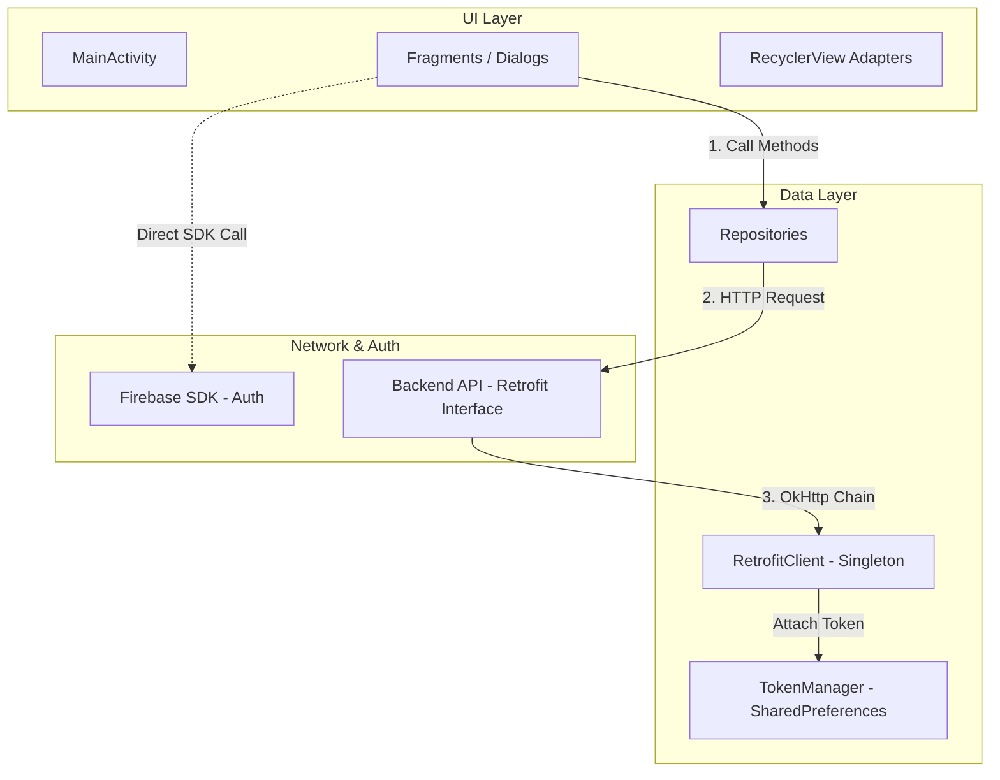

# EngFlex Mobile - Android Client Documentation

Tài liệu chi tiết kiến trúc, luồng hoạt động, các màn hình và tích hợp kỹ thuật của phần **Mobile** thuộc dự án EngFlex.

---

## 1. Kiến Trúc Ứng Dụng

Ứng dụng Android của EngFlex được viết hoàn toàn bằng **Java** (không sử dụng Kotlin) và xây dựng trên mô hình **Fragment-Repository-API**.

> [!IMPORTANT]
> **Không có lớp ViewModel và LiveData:**
> Mặc dù dự án khai báo thư viện `lifecycle-viewmodel-ktx` và `lifecycle-livedata-ktx` trong file cấu hình Gradle, mã nguồn thực tế **không sử dụng** bất kỳ class ViewModel nào. Luồng dữ liệu hoạt động hoàn toàn bằng cơ chế **Callback không đồng bộ** (sử dụng interface tự định nghĩa như `BaseCallback<T>`, `lessonsCallback<T>`, v.v.). Các Fragment sẽ trực tiếp khởi tạo và gọi Repository, sau đó cập nhật dữ liệu lên giao diện (UI) ngay bên trong hàm callback nhận kết quả.

---

## 2. Phân Tích Cấu Trúc Module

Mặc dù trong thư mục root của thư mục `mobile/` xuất hiện cấu trúc các thư mục:
- `core/`
- `feature/`

Tuy nhiên, đây là **cấu trúc mô phỏng bộ khung chưa hoàn thiện** (chỉ chứa các lớp Java rỗng/stub classes không có mã logic nghiệp vụ).
- Dự án thực tế **không đăng ký** các thư mục này làm submodule trong tệp cấu hình `settings.gradle.kts`.
- Toàn bộ mã nguồn ứng dụng thực tế chạy được nằm tập trung trong một Gradle module duy nhất là **`:app`** (nằm tại đường dẫn `mobile/app`).

---

## 3. Sơ Đồ Điều Hướng & Giao Diện (Navigation & UI Flow)

Ứng dụng sử dụng thư viện **Jetpack Navigation Component** để quản lý điều hướng giữa các màn hình (Fragments). Giao diện chính sử dụng một thanh điều hướng tùy biến phía dưới (**CustomBottomNav**) gồm 5 tab chức năng chính:

1. 📖 **Học tập** (`StudyFragment`):
   - Xem danh sách bài học chia theo cấp độ.
   - Chọn bài học -> hiển thị hộp thoại `ChooseModeBottomSheet` để chọn một trong hai chế độ:
     - **Dictation (Chính tả)** (`DictationFragment`): Nghe và hoàn thành câu bằng các thẻ từ (`WordCardAdapter`).
     - **Listening (Nghe hiểu)** (`ListeningFragment`): Học qua video.
   - Thêm/Sửa ghi chú trực tiếp cho bài học (`AddNoteFragment`, `EditNoteFragment`).
2. 📚 **Từ vựng** (`VocabularyFragment`):
   - Hiển thị các danh mục từ vựng mặc định của hệ thống và các bộ từ vựng cá nhân tự tạo (`VocabularyUserDecksFragment`).
   - Màn hình chi tiết từ vựng (`DetailItems`) hỗ trợ ôn tập bằng thẻ ghi nhớ Flashcard (`FlashcardFragment`) hoặc học từ mới (`LearningFragment`).
   - Cho phép thêm/sửa/xóa từ vựng trong bộ cá nhân (`AddVocabularyItemFragment`, `EditItemsFragment`).
3. 🔍 **Detect object (SnapWords)** (`SnapWordsFragment`):
   - Chức năng chụp ảnh nhận diện vật thể để học từ vựng (Sử dụng API CameraX để chụp ảnh).
4. 📊 **Tiến độ** (`ProgressFragment`):
   - Sử dụng ViewPager2 để hiển thị hai tab con: Bài học đã hoàn thành (`ProgressFragmentCompleted`) và bài học đang học dở (`ProgressFragmentUncompleted`).
5. ⚙️ **Cài đặt** (`SettingsFragment`):
   - Xem thông tin cá nhân, đăng xuất.
   - Truy cập trang quản lý toàn bộ ghi chú cá nhân (`MyNoteFragment`).

---

## 4. Tích Hợp Kỹ Thuật Đặc Thù

### 4.1. Trình phát YouTube (WebView Bridge)
Ứng dụng không sử dụng thư viện Android YouTube Player API chính thức của Google, thay vào đó nó sử dụng giải pháp nhúng **WebView** để tải trang web chứa mã nhúng iframe của YouTube (`youtube-nocookie.com`).
- Lớp điều khiển chính: `YouTubeWebViewManager`.
- Hoạt động bằng cách truyền lệnh điều khiển (Play, Pause, SeekTo, Change Speed) dưới dạng các đoạn mã JavaScript qua giao thức `postMessage` của trình duyệt.
- Cho phép cắt nhỏ video để phát lặp đi lặp lại một phân đoạn cụ thể phục vụ cho tính năng nghe chép chính tả và nhại giọng.

### 4.2. Thu âm & Đánh giá phát âm (Audio Record)
Chức năng đánh giá phát âm AI yêu cầu gửi file ghi âm chất lượng cao lên backend:
- Sử dụng API **`AudioRecord`** để thu âm trực tiếp tín hiệu âm thanh thô (PCM) từ microphone với tần số lấy mẫu tiêu chuẩn `16000Hz`, kênh đơn (Mono), mã hóa `16-bit PCM`.
- Sau khi kết thúc thu âm, ứng dụng sẽ thực hiện ghi đè dữ liệu thô vào bộ nhớ đồng thời chèn thêm cấu trúc **WAV Header (44 bytes)** để chuyển đổi luồng dữ liệu PCM thô thành tệp tin âm thanh `.wav` hợp lệ.
- Gửi tệp tin `.wav` này qua Retrofit dưới dạng dữ liệu nhiều phần (`MultipartBody.Part`) đến endpoint `/api/v1/pronunciation-attempts`.

### 4.3. Xác thực người dùng (Authentication Flow)
1. Người dùng thực hiện đăng nhập/đăng ký thông qua Firebase Auth SDK trên thiết bị di động.
2. Khi thành công, ứng dụng lấy **Firebase ID Token** (JWT).
3. Lưu trữ Token này vào bộ nhớ thiết bị thông qua `TokenManager` (sử dụng `SharedPreferences`).
4. Gửi một request đồng bộ `POST auth/sync` lên Backend của EngFlex để ghi nhận thông tin tài khoản người dùng vào cơ sở dữ liệu PostgreSQL.
5. Mọi request API gửi lên sau đó sẽ được đi qua **`AuthInterceptor`** (đăng ký trong OkHttpClient) để tự động đính kèm Token xác thực vào tiêu đề request: `Authorization: Bearer <ID_TOKEN>`.

---

## 5. Đánh Giá Chất Lượng Mã Nguồn (Code Quality Review)

### 5.1. Điểm mạnh (Strengths)
- **Tự đóng gói âm thanh tối ưu**: Việc tự tính toán và ghi đè cấu trúc WAV header giúp tệp âm thanh thu được tương thích hoàn hảo với yêu cầu phân tích của Azure Speech SDK ở backend mà không cần qua thư viện chuyển đổi cồng kềnh.
- **Tùy biến cao ở WebView**: `YouTubeWebViewManager` thiết lập giao tiếp hai chiều khá mượt mà với YouTube iframe, khắc phục được các hạn chế về chính sách phân phối dịch vụ của thư viện YouTube gốc trên thiết bị không có Google Play Services.

### 5.2. Điểm yếu & Lỗ hổng tiềm ẩn (Potential Issues)
1. **Thiếu lớp kiến trúc ViewModel (Kiến trúc phình to ở Fragment)**: Việc đặt toàn bộ logic gọi API, kiểm soát trạng thái dữ liệu (State) và vẽ giao diện UI vào cùng một lớp Fragment khiến các file giao diện trở nên quá dài (nhiều file vượt quá 700 dòng code), rất khó để viết unit test độc lập và dễ xảy ra hiện tượng rò rỉ bộ nhớ (memory leaks).
2. **Khởi tạo lặp các Repositories**: Trong mỗi Fragment, các lớp Repository luôn được khởi tạo mới bằng từ khóa `new` thay vì sử dụng cơ chế Dependency Injection (DI) hoặc chia sẻ instance (Singleton), dẫn đến lãng phí tài nguyên hệ thống.
3. **Quản lý bất đồng bộ thô sơ**: Hoàn toàn phụ thuộc vào lồng các callback lồng nhau (Callback hell) để xử lý luồng dữ liệu tuần tự, gây khó khăn khi cần thực thi nhiều request song song và gộp kết quả.

### 6.3. Đề xuất cải tiến (Refactoring Suggestions)
- **Áp dụng kiến trúc MVVM**: Tách biệt mã xử lý logic nghiệp vụ ra khỏi Fragment bằng cách tạo các lớp `ViewModel` và dùng `LiveData` để Fragment quan sát (observe) thay đổi trạng thái UI.
- **Sử dụng Dependency Injection**: Cài đặt một bộ quản lý dependencies đơn giản (như Service Locator hoặc Hilt nếu chuyển sang Kotlin) để cung cấp instance cho các Repository.
- **Chuyển đổi sang Kotlin**: Dần dịch chuyển dự án sang ngôn ngữ Kotlin để sử dụng các tính năng hiện đại như Coroutines giúp xử lý tác vụ bất đồng bộ gọn gàng hơn thay thế callback truyền thống.
