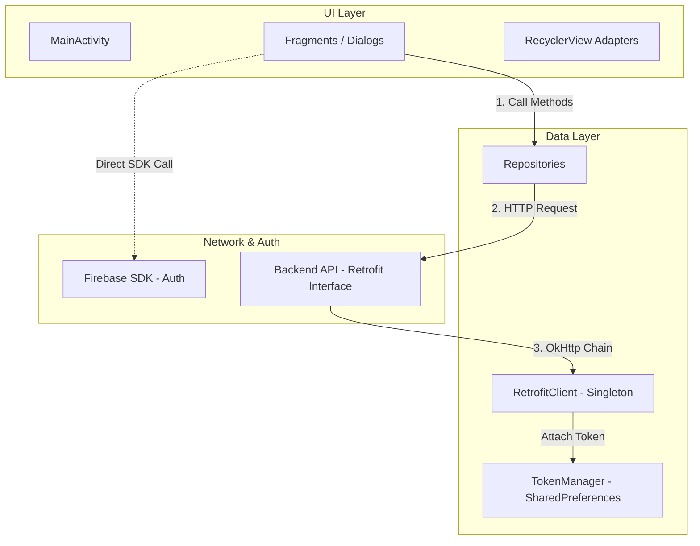

# EngFlex Mobile - Android Client Documentation

Tài liệu chi tiết kiến trúc, luồng hoạt động, các màn hình và tích hợp kỹ thuật của phần **Mobile** thuộc dự án EngFlex.

---

## 1. Kiến Trúc Ứng Dụng

Ứng dụng Android của EngFlex được viết hoàn toàn bằng **Java** (không sử dụng Kotlin) và xây dựng trên mô hình **Fragment-Repository-API**.

---

## 2. Sơ Đồ Điều Hướng & Giao Diện (Navigation & UI Flow)

Ứng dụng sử dụng thư viện **Jetpack Navigation Component** để quản lý điều hướng giữa các màn hình (Fragments). Giao diện chính sử dụng một thanh điều hướng tùy biến phía dưới (**CustomBottomNav**) gồm 5 tab chức năng chính:

1. 📖 **Học tập** (`StudyFragment`):
   - Xem danh sách bài học chia theo cấp độ.
   - Chọn bài học -> hiển thị hộp thoại `ChooseModeBottomSheet` để chọn một trong hai chế độ:
     - **Dictation (Chính tả)** (`DictationFragment`): Nghe và hoàn thành câu bằng các thẻ từ (`WordCardAdapter`).
     - **Listening (Nghe hiểu)** (`ListeningFragment`): Học qua video.
   - Thêm/Sửa ghi chú trực tiếp cho bài học (`AddNoteFragment`, `EditNoteFragment`).
2. 📚 **Từ vựng** (`VocabularyFragment`):
   - Hiển thị các danh mục từ vựng mặc định của hệ thống và các bộ từ vựng cá nhân tự tạo (`VocabularyUserDecksFragment`).
   - Màn hình chi tiết từ vựng (`DetailItems`) hỗ trợ ôn tập bằng thẻ ghi nhớ Flashcard (`FlashcardFragment`) hoặc học từ mới (`LearningFragment`).
   - Cho phép thêm/sửa/xóa từ vựng trong bộ cá nhân (`AddVocabularyItemFragment`, `EditItemsFragment`).
3. 📊 **Tiến độ** (`ProgressFragment`):
   - Sử dụng ViewPager2 để hiển thị hai tab con: Bài học đã hoàn thành (`ProgressFragmentCompleted`) và bài học đang học dở (`ProgressFragmentUncompleted`).
4. ⚙️ **Cài đặt** (`SettingsFragment`):
   - Xem thông tin cá nhân, đăng xuất.
   - Truy cập trang quản lý toàn bộ ghi chú cá nhân (`MyNoteFragment`).

---

## 3. Tích Hợp Kỹ Thuật Đặc Thù

### 3.1. Trình phát YouTube (WebView Bridge)
Ứng dụng không sử dụng thư viện Android YouTube Player API chính thức của Google, thay vào đó nó sử dụng giải pháp nhúng **WebView** để tải trang web chứa mã nhúng iframe của YouTube (`youtube-nocookie.com`).
- Lớp điều khiển chính: `YouTubeWebViewManager`.
- Hoạt động bằng cách truyền lệnh điều khiển (Play, Pause, SeekTo, Change Speed) dưới dạng các đoạn mã JavaScript qua giao thức `postMessage` của trình duyệt.
- Cho phép cắt nhỏ video để phát lặp đi lặp lại một phân đoạn cụ thể phục vụ cho tính năng nghe chép chính tả và nhại giọng.

### 3.2. Thu âm & Đánh giá phát âm (Audio Record)
Chức năng đánh giá phát âm AI yêu cầu gửi file ghi âm chất lượng cao lên backend:
- Sử dụng API **`AudioRecord`** để thu âm trực tiếp tín hiệu âm thanh thô (PCM) từ microphone với tần số lấy mẫu tiêu chuẩn `16000Hz`, kênh đơn (Mono), mã hóa `16-bit PCM`.
- Sau khi kết thúc thu âm, ứng dụng sẽ thực hiện ghi đè dữ liệu thô vào bộ nhớ đồng thời chèn thêm cấu trúc **WAV Header (44 bytes)** để chuyển đổi luồng dữ liệu PCM thô thành tệp tin âm thanh `.wav` hợp lệ.
- Gửi tệp tin `.wav` này qua Retrofit dưới dạng dữ liệu nhiều phần (`MultipartBody.Part`) đến endpoint `/api/v1/pronunciation-attempts`.

### 3.3. Xác thực người dùng (Authentication Flow)
1. Người dùng thực hiện đăng nhập/đăng ký thông qua Firebase Auth SDK trên thiết bị di động.
2. Khi thành công, ứng dụng lấy **Firebase ID Token** (JWT).
3. Lưu trữ Token này vào bộ nhớ thiết bị thông qua `TokenManager` (sử dụng `SharedPreferences`).
4. Gửi một request đồng bộ `POST auth/sync` lên Backend của EngFlex để ghi nhận thông tin tài khoản người dùng vào cơ sở dữ liệu PostgreSQL.
5. Mọi request API gửi lên sau đó sẽ được đi qua **`AuthInterceptor`** (đăng ký trong OkHttpClient) để tự động đính kèm Token xác thực vào tiêu đề request: `Authorization: Bearer <ID_TOKEN>`.

---

